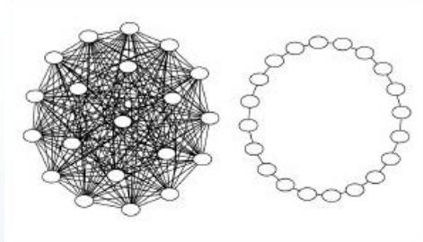
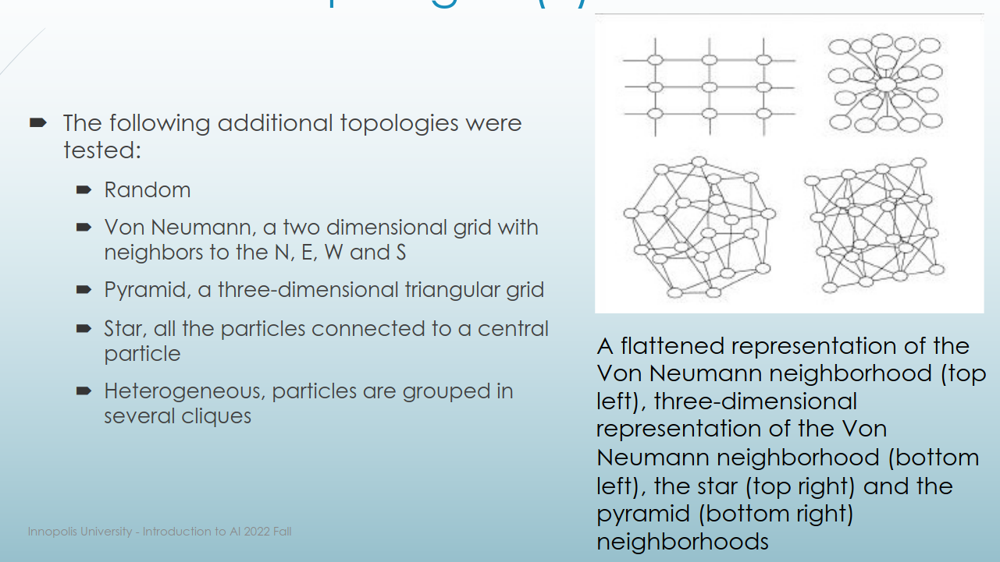

PSO (particle swarm optimization) can be used for real number optimization. In contrast, PSO has memory, EA don't

## Particle update
Pos(t) - position of particle at moment t  
V(t) - particle's velocity at moment t  
g(t) - global best at moment t  
l(t) - best for particle at moment t  

>**V(t+1)** = m*V(t) + c_1\*rand(0,1)\*(l(t) - x(t))
>                + c_2\*rand(0,1)\*(g(t) - x(t))  
>**Pos(t+1)** = Pos(t) + V(t+1)  

first term is an inertia term  
second term is a cognitive term  
third term is a social term  
m - momentum value (usually 1)  
c_1, c_2 - usually equal to 2

## PSO algorithm
First, initialze particles (their positions and velocities)  
DO:  
For each value, calculate fitness function  
Update pbest (best value) and gbest (best particle)  
For each particle, update velocity and position (using formulas above)  
WHILE maximum iterations / minimum error criteria is not attained
 
## Parameters
We can tune intertia coeff, personal/global acceleration coeffs, population amount and number of iterations.

## PSO types
1. GBEST: m=1,c_1=c_2=2, parameters should be tuned further. In GBEST, swarm can be trapped in local optima, because all particles are neighbours of each other. In contrast, in LBEST swarm, only a specific number of particles can affect the given particle's velocity. The swarm will converge slower, but it sure will to a global optima!  
Examples of topologies:

2. Von Neumann and Pyramid are best neighbourhoods, and the star and gbest are worst. 

## Ant colony optimization (ACO) 
Advantage is that a graph can change dynamically, it can adapt to changes in real time

### Algorithm:
1. Represent a solution space as a weighted graph
2. Initialize ACO parameters
3. Generate random solutions from each ant's random walk
4. Update pheromone intensities
5. Repeat step 3 until stopping condition is satisfied